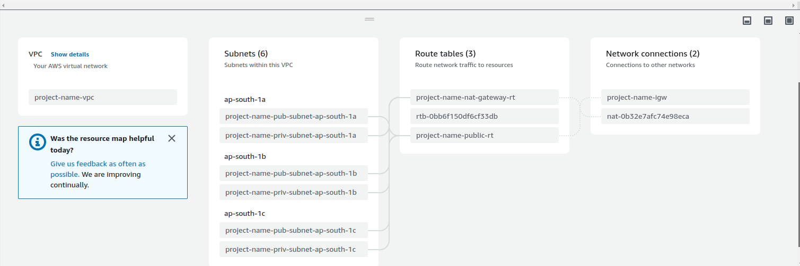

# AWS VPC with Teraform

### Note

tfvars files are used to define variable values. They can contain sensitive information, like API keys or passwords. Therefore, they should not be added to your Git repository
